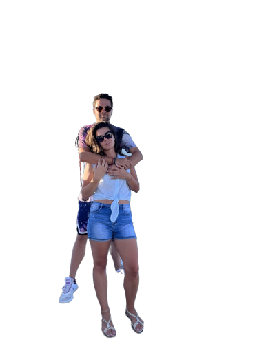

# merge-img Cog Model

This is a simple tool to combine two images. Implemented as a [Cog](https://github.com/replicate/cog) model.

## Development

Follow the [model pushing guide](https://replicate.com/docs/guides/push-a-model) to push your own model to [Replicate](https://replicate.com).

## How to use

Make sure you have [cog](https://github.com/replicate/cog) installed.

To run a prediction:

    cog predict -i foreground=@cologne.png -i background=@table.jpg

<table> <tr> <td></td> <td></td> <td></td> </tr> </table>

<table> <tr> <td></td> <td></td> <td></td> </tr> </table>
